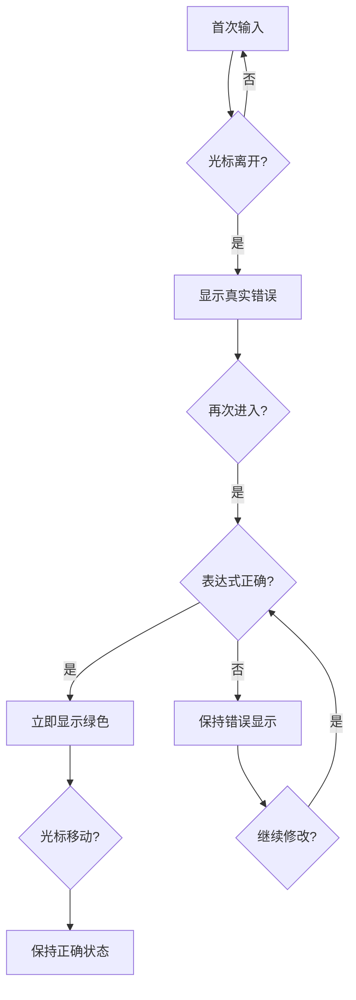

# 🎯 n8n风格光标感知验证功能使用指南

## 🎉 功能简介

我们成功在Expression Engine中实现了与n8n相同的**复杂光标感知验证机制**！这个功能采用了比简单光标检测更智能的状态管理，提供极致的用户体验。

## ✨ 核心特性

### 🧠 n8n风格复杂验证策略

- **首次输入**: 光标在 `{{ }}` 内部时，完全跳过错误显示
- **离开后**: 显示真实的验证错误状态
- **再次进入**: 如果仍有错误，保持错误显示（不隐藏）
- **实时修复**: 表达式变正确时，立即显示绿色（即使在输入中）
- **状态保持**: 正确状态在光标移动时保持稳定

### 💫 用户体验升级

- ✅ 首次输入流畅无干扰
- ✅ 错误状态清晰持久显示
- ✅ 修复成功时即时反馈
- ✅ 避免错误状态的意外隐藏
- ✅ 与n8n等顶级工具完全一致的体验

## 🚀 API使用

### 基础用法（引擎层面）

```typescript
import { ExpressionEngine } from "@choiceform/expression-engine"

const engine = new ExpressionEngine()

// n8n风格验证（简化版，真正的复杂逻辑在UI层）
const result = engine.validate("{{ $now. }}", cursorPosition)
```

### Playground完整实现

我们在playground中实现了完整的n8n风格验证机制：

```typescript
// 状态管理
const [lastKnownValidation, setLastKnownValidation] = useState(null)
const [hasLeftExpression, setHasLeftExpression] = useState(false)

// n8n风格验证逻辑
const validateExpression = useCallback(async () => {
  const isInExpression = isCursorInExpression(expression, cursorPosition)
  const realValidation = engine.validate(expression) // 总是执行真实验证

  if (isInExpression) {
    if (!hasLeftExpression) {
      // 首次输入：隐藏错误
      return { isValid: true, errors: [], warnings: [] }
    } else {
      // 再次进入：检查是否修复
      if (realValidation.isValid) {
        return realValidation // 立即显示绿色
      } else {
        return lastKnownValidation // 保持错误显示
      }
    }
  } else {
    // 离开表达式：显示真实结果
    setHasLeftExpression(true)
    setLastKnownValidation(realValidation)
    return realValidation
  }
}, [expression, cursorPosition, hasLeftExpression, lastKnownValidation])
```

## 🎮 体验步骤

### 完整测试流程：

1. **启动playground**:

   ```bash
   cd playground
   pnpm dev
   ```

2. **测试n8n风格验证**:

   **第一阶段：首次输入**

   - 在表达式输入框中输入 `{{ $now.`
   - ✅ 观察：不显示任何错误

   **第二阶段：离开表达式**

   - 点击表达式外的其他地方
   - ❌ 观察：显示"JavaScript语法错误"

   **第三阶段：再次进入**

   - 再次点击表达式内部
   - ❌ 观察：错误保持显示（关键！）

   **第四阶段：实时修复**

   - 继续输入 `toFormat('yyyy')`
   - ✅ 观察：表达式变正确时立即变绿

3. **对比传统方式**:
   - 传统方式：一输入就报错，再次进入时错误消失
   - n8n方式：首次输入不报错，错误一旦显示就持久，修复后立即反馈

## 🔧 技术实现详解

### 状态机制



### 核心逻辑

```typescript
// 关键状态变量
const [hasLeftExpression, setHasLeftExpression] = useState(false)
const [lastKnownValidation, setLastKnownValidation] = useState(null)

// 状态重置（切换表达式时）
useEffect(() => {
  setHasLeftExpression(false)
  setLastKnownValidation(null)
}, [expression])

// 复杂验证策略
if (光标在表达式内) {
  if (!hasLeftExpression) {
    return "隐藏错误" // 首次输入
  } else {
    if (表达式正确) {
      return "立即显示绿色" // 修复成功
    } else {
      return "保持错误显示" // 仍有错误
    }
  }
} else {
  setHasLeftExpression(true)
  return "显示真实结果" // 离开表达式
}
```

## 📋 完整状态转换表

| 场景       | 光标位置 | hasLeftExpression | 表达式状态 | 显示结果 | 说明         |
| ---------- | -------- | ----------------- | ---------- | -------- | ------------ |
| 首次输入   | 表达式内 | false             | 任意       | ✅ 成功  | 隐藏所有错误 |
| 离开表达式 | 表达式外 | true              | 错误       | ❌ 错误  | 显示真实状态 |
| 再次进入   | 表达式内 | true              | 错误       | ❌ 错误  | 保持错误显示 |
| 实时修复   | 表达式内 | true              | 正确       | ✅ 成功  | 立即变绿     |
| 保持正确   | 任意     | true              | 正确       | ✅ 成功  | 状态稳定     |

## 🎯 最佳实践

### 1. UI集成

```typescript
// 监听光标变化
<ExpressionEditor
  onCursorChange={setCursorPosition}
  validation={validation}
/>

// 状态管理
useEffect(() => {
  validateExpression().then(setValidation)
}, [expression, cursorPosition])
```

### 2. 性能优化

- 使用useCallback避免重复渲染
- 状态变化时才重新验证
- 缓存验证结果

### 3. 用户体验

- 首次输入时保持界面简洁
- 错误状态一旦显示就保持稳定
- 修复成功时提供即时反馈

## 🎪 Demo演示

访问playground查看完整的n8n风格验证演示：

```bash
cd playground
pnpm dev
# 打开 http://localhost:5173
```

## 🏆 总结

这个n8n风格的验证机制比简单的光标感知更加复杂和智能：

### 简单光标感知 vs n8n风格

| 特性       | 简单光标感知 | n8n风格         |
| ---------- | ------------ | --------------- |
| 首次输入   | 跳过验证 ✅  | 跳过验证 ✅     |
| 离开表达式 | 显示错误 ✅  | 显示错误 ✅     |
| 再次进入   | 跳过验证 ❌  | 保持错误显示 ✅ |
| 修复检测   | 不支持 ❌    | 实时检测 ✅     |
| 状态管理   | 简单         | 复杂但智能      |

### 核心价值

- 🎯 **首次输入友好**：不干扰用户的输入流程
- 🔒 **错误状态稳定**：避免错误的意外隐藏
- ⚡ **修复即时反馈**：鼓励用户积极修复错误
- 🎨 **专业级体验**：与顶级工具n8n保持一致

现在Expression Engine提供了市面上最先进的表达式验证用户体验！
